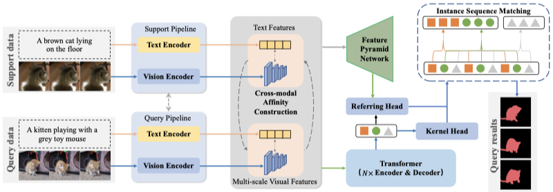

The official implementation of the IJCV2025 paper: 

<div align="center">
<h1>
<b>
Few-Shot Referring Video Single- and Multi-Object Segmentation via Cross-Modal Affinity with Instance Sequence Matching
</b>
</h1>
</div>


<p align="center"></p>


Referring Video Object Segmentation (RVOS) aims to segment specific objects in videos based on the provided natural language descriptions. As a new supervised visual learning task, achieving RVOS for a given scene requires a substantial amount of annotated data. However, only minimal annotations are usually available for new scenes in realistic scenarios. Another practical problem is that, apart from a single object, multiple objects of the same category coexist in the same scene. Both of these issues may significantly reduce the performance of existing RVOS methods in handling real-world applications. In this paper, we propose a simple yet effective model to address these issues by incorporating a newly designed cross-modal affinity (CMA) module based on a Transformer architecture. The CMA module facilitates the establishment of multi-modal affinity over a limited number of samples, allowing the rapid acquisition of new semantic information while fostering the model’s adaptability to diverse scenarios. Furthermore, we extend our FS-RVOS approach to multiple objects through a new instance sequence matching module over CMA, which filters out all object trajectories with similarity to language features that exceed a matching threshold, thereby achieving few-shot referring multi-object segmentation (FS-RVMOS). To foster research in this field, we establish a new dataset based on currently available datasets, which covers many scenarios in terms of single-object and multi-object data, hence effectively simulating real-world scenes. Extensive experiments and comparative analyses underscore the exceptional performance of our proposed FS-RVOS and FS-RVMOS methods. Our method consistently outperforms existing related approaches through practical performance evaluations and robustness studies, achieving optimal performance on metrics across diverse benchmark tests.

> [**Few-Shot Referring Video Single- and Multi-Object Segmentation via Cross-Modal Affinity with Instance Sequence Matching**](https://arxiv.org/abs/2309.02041v1)
>
> Heng Liu, Guanghui Li, Mingqi Gao, Heng Liu, Xiantong Zhen, Feng Zheng, Yang Wang*


## Requirements

We test the codes in the following environments; other versions may also be compatible:

- CUDA 11.3 
- Python 3.9
- Pytorch 1.10.1


## Data Preparation
Create a new directory data to store all the datasets.

1. Downlaod the Mini-Ref-YouTube-VOS dataset and Mini-Ref-SAIL-VOS dataset from the [website](https://drive.google.com/drive/folders/1ZdrQY8gKKEmMoJxP13ZZ5_Qrc4hGoZUj?usp=sharing).
2. Put the dataset in the `./data` folder.
```
data
├─ Mini-Ref-YouTube-VOS
│   ├─ meta_expressions
│   └─ train
│       ├─ Annotations
│       ├─ JPEGImages
│       └─ train.json
├─ Mini-Ref-SAIL-VOS
│   ├─ meta_expressions
│   └─ train
│       ├─ Annotations
│       ├─ JPEGImages
│       └─ train.json

```


### Training
```
./scripts/train_ytvos.sh [/path/to/output_dir] [/path/to/pretrained_weight] --backbone [backbone]  --group 1
```

### Inference & Evaluation

```
python test.py --dataset_file mini-ytvos --group 1
```


## Acknowledgement
This repo is based on [ReferFormer](https://github.com/wjn922/ReferFormer) and [DANet](https://github.com/scutpaul/DANet). Thanks for these outstanding works.

## Citation

```
@article{Heng_2025_IJCV,
  title={Few-Shot Referring Video Single- and Multi-Object Segmentation via Cross-Modal Affinity with Instance Sequence Matching},
  author={Heng Liu, Guanghui Li, Mingqi Gao, Heng Liu, Xiantong Zhen, Feng Zheng, Yang Wang},
  journal={International Journal of Computer Vision},
  year={2025}
}

@InProceedings{Li_2023_ICCV,
    author    = {Li, Guanghui and Gao, Mingqi and Liu, Heng and Zhen, Xiantong and Zheng, Feng},
    title     = {Learning Cross-Modal Affinity for Referring Video Object Segmentation Targeting Limited Samples},
    booktitle = {Proceedings of the IEEE/CVF International Conference on Computer Vision (ICCV)},
    month     = {October},
    year      = {2023},
    pages     = {2684-2693}
}
```


