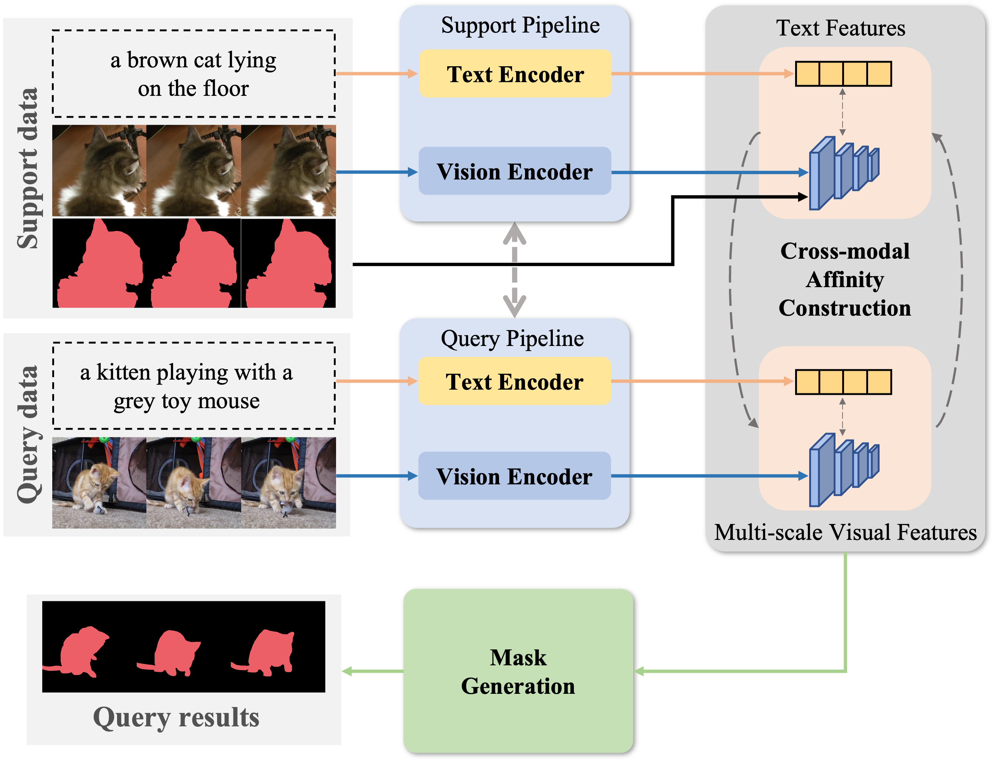

The official implementation of the ICCV2023 paper: 

<div align="center">
<h1>
<b>
Learning Cross-Modal Affinity for Referring Video Object Segmentation 
Targeting Limited Samples
</b>
</h1>
</div>


<p align="center"></p>


Referring video object segmentation (RVOS), as a supervised learning task, relies on sufficient annotated data for a given scene. However, in more realistic scenarios, 
only minimal annotations are available for a new scene, which poses significant challenges to existing RVOS methods.
With this in mind, we propose a simple yet effective model with a newly designed cross-modal affinity (CMA) module based on a Transformer architecture. 
The CMA module builds multimodal information affinity in a few samples, quickly learns new semantic information, and enables the model to adapt to different scenarios.
Since the proposed method targets limited samples for new scenes, then we generalize the problem as - few-shot referring video object segmentation (FS-RVOS).
To foster research in this direction, we build up a new FS-RVOS benchmark based on currently available relevant datasets. 
The benchmark covers a wide range and includes multiple situations, which can maximally simulate real-world scenarios.
Extensive experiments show that our model can adapt well to different scenarios by only relying on a few samples. 
Likewise, our model outperforms the baselines significantly on benchmarks, reaching state-of-the-art performance. 
On Mini-Ref-YouTube-VOS, our model achieves an average performance of 53.1 J and 54.8 F, which is 10% better than the baseline performance. 
Furthermore, we show impressive results of 77.7 J and 74.8 F on Mini-Ref-SAIL-VOS, which are significantly better than the baseline.

> [**Learning Cross-Modal Affinity for Referring Video Object Segmentation 
Targeting Limited Samples**](https://arxiv.org/abs/2309.02041v1)
>
> Guanghui Li, Mingqi Gao, Heng Liu, Xiantong Zhen, Feng Zheng


## Requirements

We test the codes in the following environments, other versions may also be compatible:

- CUDA 11.3 
- Python 3.9
- Pytorch 1.10.1


## Data Preparation
Create a new directory data to store all the datasets.

1. Downlaod the Mini-Ref-YouTube-VOS dataset and Mini-Ref-SAIL-VOS dataset from the [website](https://drive.google.com/drive/folders/1ZdrQY8gKKEmMoJxP13ZZ5_Qrc4hGoZUj?usp=sharing).
2. Put the dataset in the `./data` folder.
```
data
├─ Mini-Ref-YouTube-VOS
│   ├─ meta_expressions
│   └─ train
│       ├─ Annotations
│       ├─ JPEGImages
│       └─ train.json
├─ Mini-Ref-SAIL-VOS
│   ├─ meta_expressions
│   └─ train
│       ├─ Annotations
│       ├─ JPEGImages
│       └─ train.json

```


### Training
```
./scripts/train_ytvos.sh [/path/to/output_dir] [/path/to/pretrained_weight] --backbone [backbone]  --group 1
```

### Inference & Evaluation

```
python test.py --dataset_file mini-ytvos --group 1
```


## Acknowledgement
This repo is based on [ReferFormer](https://github.com/wjn922/ReferFormer) and [DANet](https://github.com/scutpaul/DANet). Thanks for their wonderful works.

## Citation

```
@InProceedings{Li_2023_ICCV,
    author    = {Li, Guanghui and Gao, Mingqi and Liu, Heng and Zhen, Xiantong and Zheng, Feng},
    title     = {Learning Cross-Modal Affinity for Referring Video Object Segmentation Targeting Limited Samples},
    booktitle = {Proceedings of the IEEE/CVF International Conference on Computer Vision (ICCV)},
    month     = {October},
    year      = {2023},
    pages     = {2684-2693}
}
```


